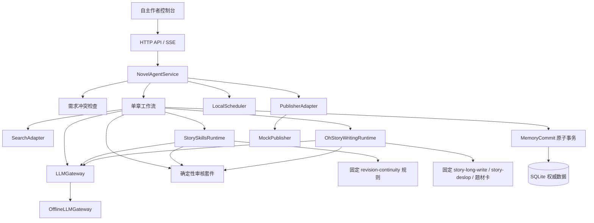
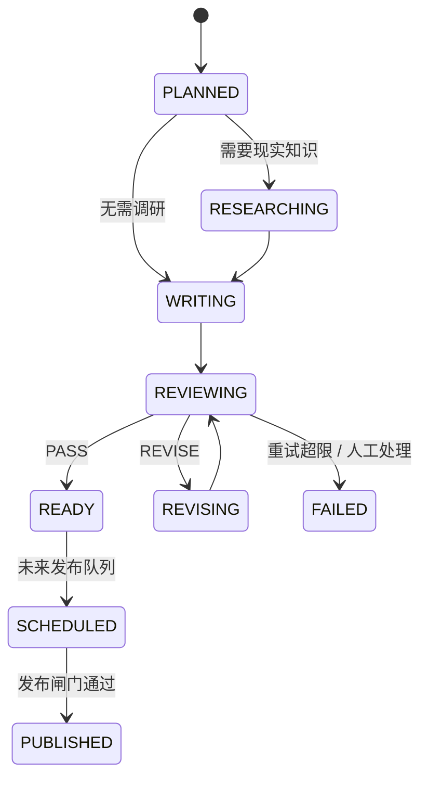

# 架构与状态边界

## 运行链路

真实模型、搜索、Temporal、PostgreSQL/pgvector、Redis、MinIO 和发布平台都位于可替换边界之后。业务服务不直接引用供应商 SDK。

## 单章状态机

当前版本实现到 `READY`。`SCHEDULED` 与 `PUBLISHED` 只保留状态和适配器边界，绝不会把刚生成的章节当作已发布内容。

## 不变量

1. 一个章节对应一个稳定 `chapter_id` 和独立 `run_id`。
2. 草稿版本可以追加，不能覆盖历史版本。
3. 只有审核通过后才执行 `commit_ready_chapter`。
4. 正文正式版本、项目进度、人物状态、时间线和审核报告在同一 SQLite 事务内提交。
5. 失败工作流保存最后节点与错误分类，不更新正式记忆。
6. `READY`、`SCHEDULED`、`PUBLISHED` 严格分离。
7. 外部 API 默认关闭；真实发布适配器默认不可实例化。
8. Story Skills 只提供固定审校规则与确定性契约；oh-story 只提供情绪规划、题材正文提示和去 AI 味规则。
9. 两套技能均固定到已审查的上游提交；oh-story 的 Hooks、自定义 Agent 和脚本不会被执行。
10. SQLite 仍是唯一权威故事存储，第三方 Node CLI 不自动操作正式数据。

## 演进路径

- 将 `NovelAgentHandler` 替换为 FastAPI 路由，保留 `NovelAgentService`。
- 将 `ChapterWorkflow` 节点映射到 LangGraph，保留节点输入输出模型和事务提交点。
- 将 `SQLiteRepository` 替换为 SQLAlchemy/PostgreSQL 仓库，数据库变更交给 Alembic。
- 将 `LocalScheduler` 替换为 Temporal Workflow/Worker，保留 `fill_reserve` 的业务语义。
- 最近摘要和研究资料可增加 pgvector 派生索引；人物当前状态与世界硬规则仍以关系库为权威。
